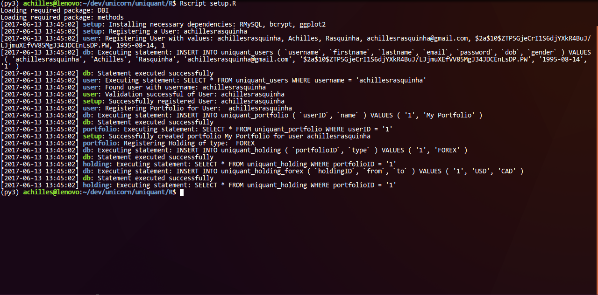

<div align="center">
  <h1>uniquant</h1>
</div>

### Table of Contents
* [Installation](#installation)
* [Environment Variables](#environment-variables)
  * [General Environment Variables](#general-environment-variables)
  * [Database Environment Variables](#database-environment-variables)
* [Example](#example)
* [Debugging](#debugging)
* [Documentation](#documentation)

### Installation
Go ahead and install necessary dependencies:
* R Dependencies
  
  ```console
  $ Rscript setup.R
  ```

* Python Dependencies

  ```console
  $ pip install -r requirements.txt
  ```

### Environment Variables
* #### General Environment Variables

| Environment Variable Name | Default                        | Description
|---------------------------|--------------------------------|-------------
| `UNIQUANT_PACKAGE_MIRROR` | "http://cran.us.r-project.org" | CRAN mirror to download packages from.
| `UNIQUANT_CACHEDIR`       | "`$HOMEDIR`/_uniquant"         | A cache directory for uniquant.

* #### Database Environment Variables

| Environment Variable Name | Default                        | Description
|---------------------------|--------------------------------|-------------
| `UNIQUANT_DB_NAME`        | `"uniquant"`                   | Database Name
| `UNIQUANT_DB_HOST`        | `"127.0.0.1"`                  | Host Name for your database
| `UNIQUANT_DB_PORT`        | `0`                            | Port Number for your database
| `UNIQUANT_DB_USER`        | `"uniquant_admin"`             | A database username
| `UNIQUANT_DB_PASS`        | `""`                           | Password for the said username
| `UNIQUANT_DB_PREFIX`      | `"uniquant_"`                  | Prefixes for table names
| `UNIQUANT_PASSWORD_SALT`  | `10`                           | A numeric salt value for the **bcrypt** password hashing algorithm. Bigger the number, bigger the complexity for encryption/decryption.

### Example
Run the `example.R` script as follows:
```console
$ Rscript example.R
```

### Debugging
`uniquant` has a neat color-signaled debugging framework. To launch into debug mode, simply:
```r
> source('util/log.R')
> log.DEBUG <<- TRUE
```

You should then have your terminal output as follows:



### Documentation

* #### Entities
  * ##### Users
    * `user.exists`

      A helper function to check whether a user exists based on a given `username`.

      **Example**
      ```r
      > source('entity/user.R')
      > user.exists('achillesrasquinha')
      [1] TRUE
      > user.exists('senpai')
      [1] FALSE
      ```

    * `user.register`

      A helper function to register new users. Returns a `data.frame` with a single row containing user details or `NULL` if a user with a same `username` or `email` has been already registered. Passwords are **bcrypt hashed**.

      **Example**
      ```r
      > source('constant.R')    # gender
      > source('entity/user.R')

      > user <- user.register(
      +   username  = 'achillesrasquinha',
      +   firstname = 'Achilles',
      +   lastname  = 'Rasquinha',
      +   email     = 'achillesrasquinha@gmail.com',
      +   password  = '12345',
      +   dob       = '1995-08-14',
      +   gender    = gender.MALE
      + )
        ID          username firstname  lastname                       email
      1  1 achillesrasquinha  Achilles Rasquinha achillesrasquinha@gmail.com
                                                            password
      1 $2a$10$D1i7TYG8wUV2Xint7paEvOxeL56WUOZgVx4.oCaz.L50g5I9jCm06
                        dob gender                 dor
      1 1995-08-14 00:00:00      1 2017-06-13 17:01:41
      ```

    * `user.get`

      A helper function to retrieve user information. Requires a `username` and `password`. Returns `NA` user does not exists and `NULL` if if not a valid `username` and `password`.

      **Example**
      ```r
      > source('entity/user.R')
      > user <- user.get('achillesrasquinha', '12345')
      ```

  * ##### Portfolio
    * `portfolio.register`

      A helper function to create new portfolio for a said user. Returns a `data.frame` with a single row containing portfolio details.
      ```r
      > source('entity/user.R')
      > user <- user.get('achillesrasquinha', '12345')
      > portfolio.register(user, name = 'My Portfolio')
      ```

    * `portfolio.get`

      A helper function to retrieve details about all/specific portfolios. Returns a `data.frame` containing portfolio details for a particular user.
      ```r
      > source('entity/user.R')
      > source('entity/portfolio.R')
      > user <- user.get('achillesrasquinha', '12345')
      > portfolio.get(user)
        ID userID               name
      1  2      1 My Other Portfolio
      2  1      1       My Portfolio
      > # OR
      > portfolio.get(user, name = c("My Portfolio", "My Other Portfolio"))
        ID userID               name
      1  2      1 My Other Portfolio
      2  1      1       My Portfolio
      > portfolio.get(user, name = "My Portfolio")
        ID userID               name
      1  1      1       My Portfolio
      ```

  * ##### Holding
    * `holding.add`

      A helper function to add a holding to a given portfolio.

      **Example**
      ```r
      > source('constant.R')
      > source('entity/user.R')
      > source('entity/portfolio.R')
      > source('entity/holding.R')

      > user      <- user.get('achillesrasquinha', '12345')
      > portfolio <- portfolio.get(user, name = 'My Portfolio')
      > holding   <- holding.add(portfolio, type = holding.FOREX, params = list(
      +   from   = forex.EUR,
      +   to     = forex.USD,
      +   amount = 300  
      + ))
      ```

    * `holding.get`

      A helper function to add a holding to a given portfolio.

      **Example**
      ```r
      > source('entity/user.R')
      > source('entity/portfolio.R')
      > source('entity/holding.R')

      > user      <- user.get('achillesrasquinha', '12345')
      > portfolio <- portfolio.get(user, name = 'My Portfolio')
      > holding.get(portfolio, type = holding.FOREX)
        ID portfolioID from  to amount
      1  1           1  EUR USD    300
      ```

* #### Data
  * ##### Cache
    * `cache.FOREX`

      A cache helper to cache a list of forex symbols.

      **Example**
      ```r
      > source('entity/user.R')
      > source('entity/portfolio.R')
      > source('entity/holding.R')
      > source('data/cache.R')

      > user      <- user.get('achillesrasquinha', '12345')
      > portfolio <- portfolio.get(user, name = 'My Portfolio')
      > holding   <- holding.get(portfolio, type = holding.FOREX)
      > pairs     <- paste(holding$from, holding$to, sep = '')

      > cache.FOREX(pairs)
      ```

  * ##### Scraper
    * `histdata`

      A `histdata` scraper crawls, scrapes and downloads all available files from [histdata.com](http://www.histdata.com) into the `UNIQUANT_CACHEDIR/histdata` directory.

      **Example**
      ```console
      $ python R/data/scrapers/scraper.py
      ```

* #### Backtesting
  * `back.test`

    A backtester to test on a particular holding.

    **Example**
    ```r
      > source('entity/user.R')
      > source('entity/portfolio.R')
      > source('entity/holding.R')
      > source('data/cache.R')
        
      > source('back/test.R')
      > source('entity/order.R')

      > user      <- user.get('achillesrasquinha', '12345')
      > portfolio <- portfolio.get(user, name = 'My Portfolio')
      > holding   <- holding.get(portfolio, type = holding.FOREX)
      > seed      <- 10000 # initial seed value.

      > back.test(holding, seed, function (data) {
          # your strategy here.

          # `data` is of the following format:
          # | ID | datetime | symbol | open | high | low | close | volumne |
          # datetime and OHLCV are also called "lines", in this case - 6 lines.
          # In case of FX, open is synonymous to 'bid' while close is synonymous to 'ask'.
          
          # Accessing values are done as follows:
          # Accessing current market line.
          # tail(data, n = 1)[0,] <-  current market line (or the last trade line).

          # Accessing current, previous market line.
          # tail(data, n = 2)[0,] <- previous market line.
          # tail(data, n = 2)[1,] <-  current market line.

          # buy when even, sell when odd.
          random  <- sample(1:100, 1)

          if ( is.equal(random %% 2, 0) ) {
            order <- list(symbol = 'EURUSD', units = 1000, type = order.MARKET, trade = trade.BUY)
          } else {
            order <- list(symbol = 'EURUSD', units = 1000, type = order.MARKET, trade = trade.SELL)
          }

          return(order)
        })
    ```

    Run the backtester using the example.R script as follows:
    
    
